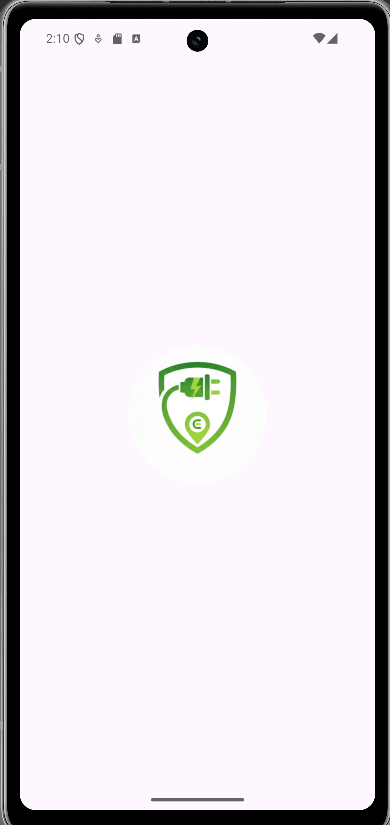
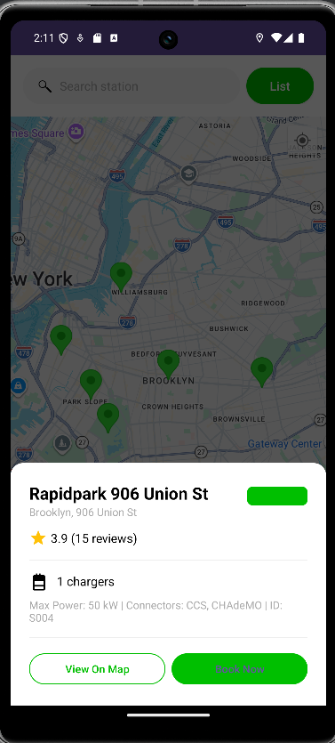
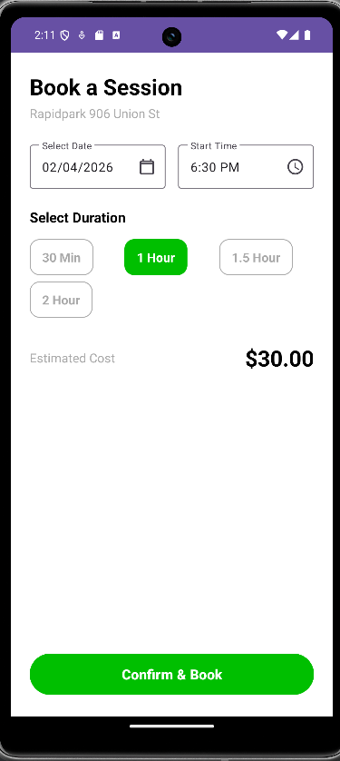
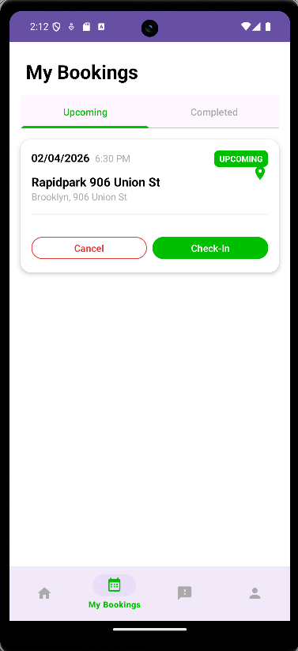
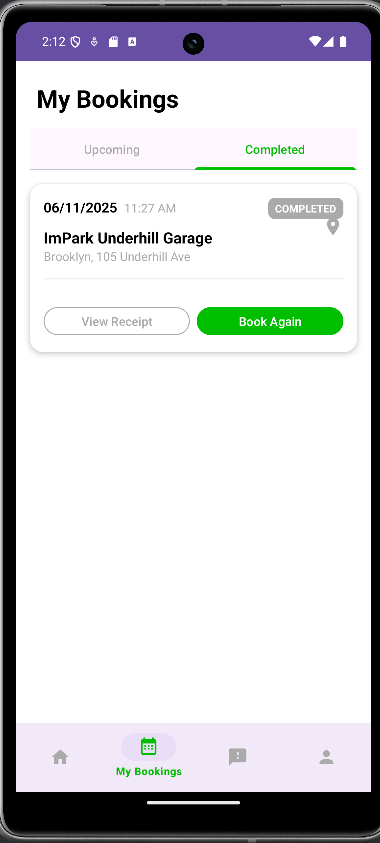
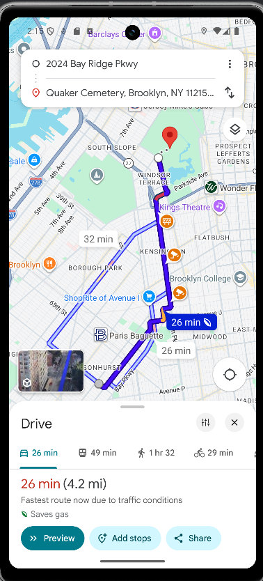

# ChargeEasy – EV Charging Android Application

## Overview

ChargeEasy is a full-stack Android application designed to simplify electric vehicle charging by enabling real-time station detection, route optimization, and slot booking using Google Maps integration.

---

## Features

* Real-time EV charging station detection
* Google Maps integration
* Smart route optimization
* Slot booking system
* Secure API key handling using `local.properties`

---

## Live Demo (APK Download)

[Download & Install APK](https://drive.google.com/file/d/1AIRq96iCuqtKBldKQLRlRXuyRK2ihmtw/view?usp=sharing)

---

## Screenshots








---

## Tech Stack

* Java (Android Development)
* Google Maps API
* Gradle Build System
* XML (UI Design)

---

## Setup Instructions

1. Clone the repository:

   ```
   git clone https://github.com/manav-shah18/ChargeEasy-Mobile-Application.git
   ```

2. Open the project in Android Studio

3. Add your API key in `local.properties`:

   ```
   MAPS_API_KEY=your_api_key_here
   ```

4. Sync Gradle and run the app

---

## Key Highlights

* Implemented real-time location tracking
* Designed structured booking system
* Integrated secure API key handling
* Optimized user experience with map-based navigation

---

## Future Improvements

* Live charging slot availability
* Payment integration
* AI-based route suggestions
* Push notifications

---

## Author

**Manav Shah**

---

## If you like this project

Give it a ⭐ on GitHub!
